# Lisp interpreter in Rust

![Rust Version][rustc-image]
[![crates.io][crate-image]][crate-link]
[![Documentation][docs-image]][docs-link]
[![Dependency Status][deps-image]][deps-link]

### Code Challenges #30 

## Diagrams

(using mermaid)

```mermaid
flowchart LR
    id["This ❤ Unicode"]
    markdown["`This **is** _Markdown_`"]
    newLines["`Line1
    Line 2
    Line 3`"]
    id --> markdown
    markdown --> newLines
```

## References

* [rust-cli-template](https://github.com/kbknapp/rust-cli-template)

[//]: # (badges)

[rustc-image]: https://img.shields.io/badge/rustc-1.60+-blue.svg
[crate-image]: https://img.shields.io/crates/v/{{project-name}}.svg
[crate-link]: https://crates.io/crates/{{project-name}}
[docs-image]: https://docs.rs/{{project-name}}/badge.svg
[docs-link]: https://docs.rs/{{project-name}}
[deps-image]: https://deps.rs/repo/github/palutz/lisp_interpreter_rs/status.svg
[deps-link]: https://deps.rs/repo/github/palutz/lisp_interpreter_rs
